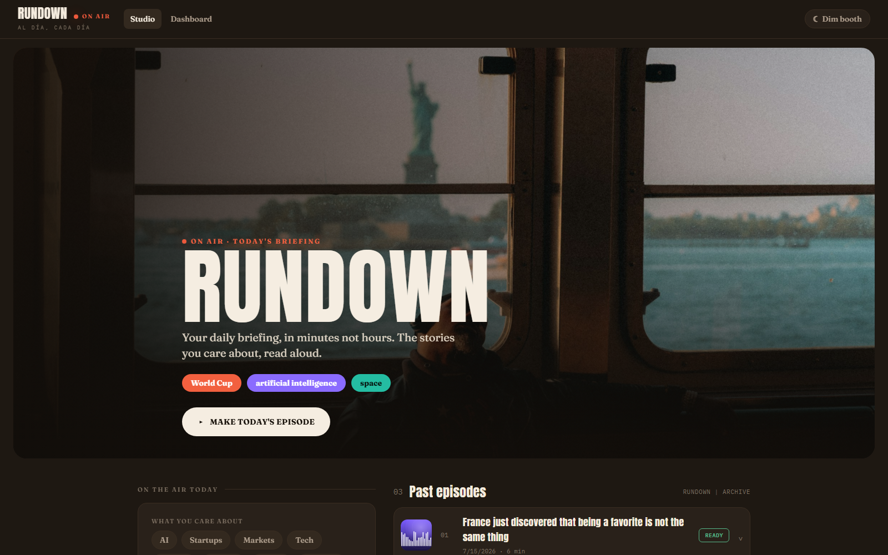
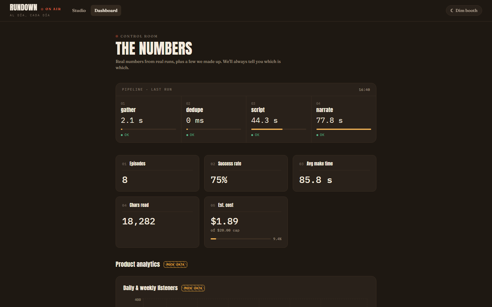

# Rundown

A personal daily news podcast, generated on your machine, for well under a dollar an episode at the default rates.

Tell Rundown what you care about and it produces a five-minute briefing you would actually listen to: it gathers fresh news on your interests, picks the stories worth your time, writes a script with a point of view, and reads it aloud in a good voice.

One structured LLM call both selects the stories and writes the full segmented script, and one TTS call per segment renders it, each delivered at the energy the script asks for and conditioned on its neighbors so the voice stays continuous.

Splitting narration by segment costs nothing extra (TTS bills per character), and it buys expressive delivery: stories the listener cares about get read like they matter. Everything else is free, local, and deterministic.





## How it works

A generation runs as a straight pipeline:

```
interests
   |
   v
gather (Google News RSS, free)      one item per story, many overlapping
   |
   v
dedupe (deterministic, free)        collapse syndicated duplicates
   |
   v
script  (1 LLM call, paid)          select 4-6 stories, order them, write
   |                                segments: {kind, speaker, text, energy}
   v
narrate (1 TTS call/segment, paid)  each segment at its energy, prosody
   |                                conditioned on the neighboring text
   v
assemble (local, free)              PCM + topic gaps + a quiet ding,
   |                                encode one MP3, measure exact duration
   v
persist (SQLite + local MP3)        transcript + per-stage timing + cost
```

The single LLM call does the editorial work: choose the best stories, order them for pacing, and write the script as an ordered list of segments. Each segment carries a `kind` (intro, story, transition, outro), a `speaker`, pure spoken `text`, and an `energy` (calm, warm, high) that tracks how much this listener cares about the topic.

Each segment then goes to ElevenLabs as its own call. The energy bends the voice settings (a high-energy story gets lower stability and more style, so it reads livelier), and each call is conditioned on the neighboring segments' text (`previous_text`/`next_text`) so the prosody carries across calls and it stays one continuous host.

The PCM comes back raw, gets assembled locally with a beat of air and a quiet ding between topics, and is encoded to MP3 on the machine, which also makes the reported duration exact rather than estimated. Set `NARRATION_MODE=single` to fall back to the original one-call narration.

The React app is two pages: a **Studio** for preferences, generation, and playback, and a **Dashboard** showing real run metrics alongside clearly labeled mock product analytics.

The segment contract is host-agnostic on purpose. Single-host is what ships: every segment uses one speaker and one voice. Two-host is the same contract with alternating `host_a` and `host_b` speakers, and the prompt can already write it (there is a sample script at `docs/sample-episode-two-host.md`).

The segmented narration engine now does most of the mechanical work two-host would need (per-segment synthesis, conditioning, local assembly). What remains unwired is per-speaker voice routing and loudness-matching two different voices, so two-host stays a documented extension, not a claim. See `solution.md`.

## Run it locally

You need Python 3.11+ and Node 18+.

```
cp .env.example backend/.env            # keys optional while USE_FAKES=1
make setup                              # backend (pip -e) + frontend (npm install)
make test                               # offline test suite, no network, no spend
```

With `USE_FAKES=1` (the default in `.env.example`) the LLM and TTS clients are fakes: everything runs offline and free, no keys needed. Add your OpenAI and ElevenLabs keys and set `USE_FAKES=0` for real episodes.

Start the app with one command, any OS:

```
python dev.py     # API on :8000, UI on :5173; Ctrl-C stops both
```

Then open http://localhost:5173. `make dev` runs the same thing. Prefer two terminals? That works too:

```
# terminal 1: API on http://localhost:8000
cd backend && uvicorn app.main:app --reload --port 8000

# terminal 2: UI on http://localhost:5173
cd frontend && npm run dev
```

Other targets:

```
make seed      # 90 days of clearly-flagged mock analytics for the Dashboard
make sample    # one REAL end-to-end generation, writes sample.mp3 (spends budget)
```

## Scheduling

Generation is a headless CLI, not an in-process scheduler, so the operating system does the timing and there is nothing to restart:

```
cd backend && USE_FAKES=0 python -m app.generate     # generate one episode now
```

Wire it to cron (Unix) or Task Scheduler (Windows). Example crontab for 7am daily:

```
0 7 * * *  cd /path/to/rundown/backend && USE_FAKES=0 /path/to/python -m app.generate
```

The schedule cadence and time you set in the Studio are saved as preferences and drive a computed next-run readout; the actual firing is whatever cron entry you install. The API and the CLI generate through the same code path.

## Design decisions

- **One LLM call selects and writes.** The model that picks the stories is the model shaping the narrative, so pacing is coherent and cost is one call, not five.
- **Premium where it is heard, free where it is not.** One capable model does the editorial work (select and write) in a single paid call, and a quality ElevenLabs voice renders it; gather and dedupe are deterministic and free. All model ids and rates are configurable in `.env`.
- **Expressive narration over call-count minimalism.** The first cut narrated a whole episode in one TTS call, which was tidy but read flat: every story at the same pitch. Splitting narration per segment costs the same (billing is per character) and lets the energy the script asked for actually reach the voice, with each call conditioned on its neighbors' text to keep the read continuous. Eleven v3's inline audio tags were the tempting shortcut and were rejected: its 5,000-character cap cannot fit a ten-minute episode in one call, so it would need the same chunking and stitching work anyway, on a model ElevenLabs documents as less predictable. For a daily briefing, predictable delivery beat audio-tag expressiveness.
- **Fake LLM and TTS adapters behind the same interfaces.** Dev, tests, and CI cost nothing and never flake on the network. The fake TTS records its calls and returns real PCM, so tests can assert the load-bearing properties: one synthesis call per segment, each conditioned on the right neighbors, and billed characters that match what the provider reports.
- **Scheduling is persisted config plus a headless CLI**, not an in-process scheduler with restart and duplicate-run problems.
- **SQLite and local MP3 files.** The right size for one listener on one machine. The engine reads a `DATABASE_URL`, so Postgres is a connection string away (plus a driver and migrations); object storage stays documented, not built.
- **Dashboard honesty.** Real metrics (latency, cost, success rate) come from real runs. Mock product analytics (DAU, listen-through) carry an `is_mock` flag in the data and a "Mock data, not real" badge everywhere they render in the UI.

See `solution.md` for the full trade-off reasoning and `SCHEMA.md` for the data model.
